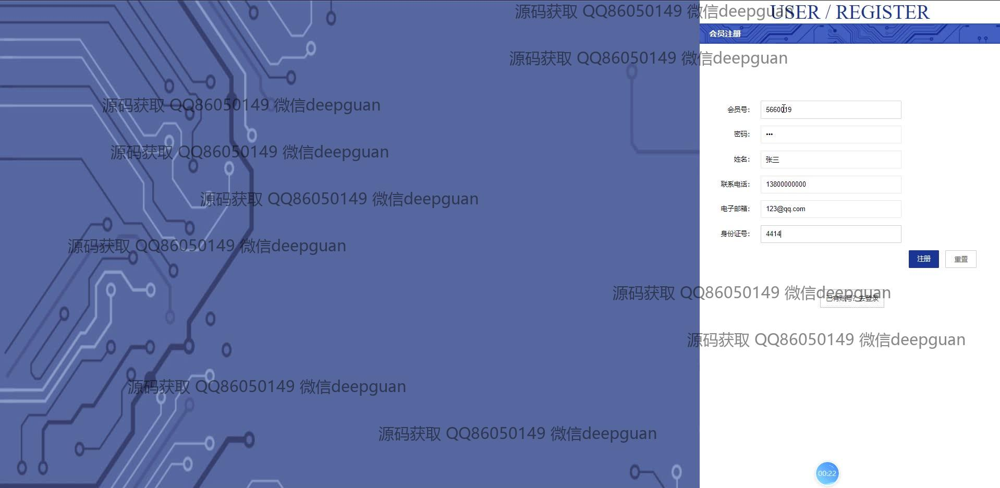

<h1 align="center">中药店商城网站vue</h1>

## 简介
中药店商城网站：角色分为管理员、会员；支持用户注册、登录、商品浏览、购物车、订单管理等功能，管理员功能包含会员管理、药材分类管理、订单管理和在线客服模块。    --计算机毕业设计源码；毕设源码；java毕业设计源码

## 联系方式

<h3 align="center">获取完整代码与数据库文件 + 微信：deepguan QQ: 86050149 QQ群: 783742310</h3>

<h3 align="center">可帮忙远程部署 包运行成功！提供远程部署、修改代码、设计文档指导、代码讲解等服务！</h3>

## 功能介绍（完整见运行截图）
管理员：登录入口，用户注册管理，身份识别为管理员或会员。后台管理：药材分类管理，药材信息管理，会员信息管理，订单管理，入库记录管理，送礼登记管理，客服管理功能。能编辑药材信息，查看和操作订单详情，管理送礼套餐，处理用户反馈，并进行在线客服交流。支持文件上传，用于药材图片和用户身份信息的管理。系统提供访问首页导航栏，用户信息及后台管理功能模块以便于综合站点操作及维护。
用户：登录注册功能，身份识别为会员。商城主要功能包括浏览商品列表，查看商品详情，进行搜索及购物车添加，完成结算及订单确认，支持积分兑换和多种支付方式。用户中心提供个人信息管理，包括查看和修改联系方式、身份证号等个人资料，查看订单历史、管理地址及收藏。支持在线客服咨询及交流，获取帮助和资讯。界面设计简洁，注重用户交互与便捷操作。

## 运行截图

本代码来源于网络,仅供学习参考使用!

